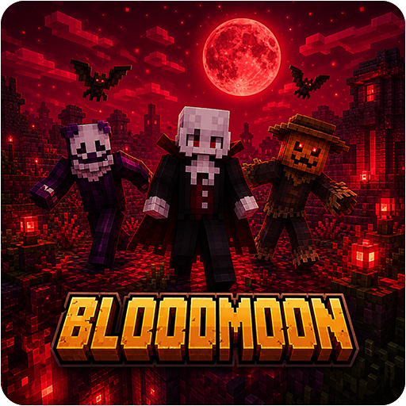

<p align="center">
  
</p>
<h1 align="center">BloodMoon Event Plugin</h1>
<p align="center">
  <b>A full encounter framework for Blood Moon nights, built around custom NPC bosses.</b><br>
  <b>Seven unique special mobs, configurable event flow, deep admin tooling, and Citizens/Sentinel integration.</b>
</p>
<p align="center">
  <a href="https://github.com/Cobbleworks/BloodMoon-Plugin/releases"></a>&nbsp;&nbsp;<a href="https://github.com/Cobbleworks/BloodMoon-Plugin/blob/main/LICENSE"></a>&nbsp;&nbsp;&nbsp;&nbsp;&nbsp;&nbsp;&nbsp;&nbsp;&nbsp;&nbsp;
</p>

BloodMoon Event is an open-source Minecraft plugin that transforms night time into a high-pressure survival event. When a Blood Moon rises, seven custom NPC bosses spawn across the configured world — each with a full ability kit, multi-phase state machine, thematic loot pool, visual effects, and unique encounter identity. The event runs on per-player spawn pressure, keeping encounters personal and consistent regardless of server population. Every mob, every parameter, and every threshold is tunable through a single configuration file.

Originally built for custom server gameplay, the plugin integrates directly with Citizens 2 and Sentinel for NPC lifecycle management, while all combat logic — abilities, damage, effects, phases — is handled entirely by BloodMoon's own controllers.

### **Core Features**

- **Seven distinct NPC bosses** — Vampire, Clown, Zombie, Witch, Scarecrow, Ghost, and Werewolf, each with a unique encounter identity and ability set
- **Phase-based state machines** — every boss has named phases that escalate combat, shift behavior, and alter ability access as HP drops
- **Per-player spawn pressure** — NPCs are spawned relative to individual players, not globally, preventing congestion on large servers
- **Citizens/Sentinel integration** — NPC lifecycle, skins, and targeting all flow through Citizens 2 and Sentinel; no custom entity types required
- **Configurable event flow** — Blood Moon chance, world scope, and all per-mob thresholds are controlled via a single `config.yml`
- **Admin commands** — force-start, force-stop, spawn-by-type, difficulty profiles, chance overrides, and live reload, all via `/bloodmoon`
- **Overhead health bars** — segmented name-tag style bars float above active special NPCs; orphan cleanup is automatic on despawn
- **Difficulty profiles** — four runtime difficulty tiers (easy / medium / hard / nightmare) adjust health, damage, ability cadence, and XP multipliers live
- **Bleed system** — stackable bleed debuff that applies ongoing damage; shared across multiple NPC types
- **Unique loot tables** — every boss drops thematic items, including custom-named trophies, enchanted gear, and rare collectibles

### **Supported Platforms**

- **Server Software:** Spigot, Paper, Purpur, CraftBukkit
- **Minecraft Versions:** 1.20 and higher
- **Java Requirements:** Java 17+
- **Required Dependencies:** Citizens 2, Sentinel

## **Table of Contents**

1. [Getting Started](#getting-started)
    - [Prerequisites](#prerequisites)
    - [Installation Steps](#installation-steps)
    - [Verifying Installation](#verifying-installation)
2. [Third-Party Libraries](#third-party-libraries)
    - [Citizens 2](#citizens-2)
    - [Sentinel](#sentinel)
3. [How The Event Works](#how-the-event-works)
    - [Lifecycle](#lifecycle)
    - [Spawn Philosophy](#spawn-philosophy)
4. [Special NPC Documentation](#special-npc-documentation)
    - [Vampire](#vampire)
    - [Clown](#clown)
    - [Zombie](#zombie)
    - [Witch](#witch)
    - [Scarecrow](#scarecrow)
    - [Ghost](#ghost)
    - [Werewolf](#werewolf)
5. [Health Bar System](#health-bar-system)
6. [Configuration Reference](#configuration-reference)
7. [Commands](#commands)
8. [Permissions](#permissions)
9. [Performance Notes](#performance-notes)
10. [Building From Source](#building-from-source)
11. [License](#license)
12. [Screenshots](#screenshots)

## **Getting Started**

### **Prerequisites**

Before installing BloodMoon Event, confirm the following requirements are met:

- A Minecraft server running **Spigot**, **Paper**, **Purpur**, or any compatible fork
- Server version **1.20 or higher**
- **Java 17** or newer installed on the machine running the server
- **Citizens 2** installed and functioning (with at least one NPC registry available)
- **Sentinel** installed as a Citizens trait provider

Both Citizens and Sentinel must be present and loading correctly before BloodMoon Event starts. BloodMoon will not function without them.

### **Installation Steps**

1. Download the latest `BloodMoon-Event-x.x.x.jar` from the [Releases](https://github.com/Cobbleworks/BloodMoon-Plugin/releases) page
2. **Stop your server completely** before placing any files
3. Verify that `Citizens.jar` and `Sentinel.jar` are already in your `plugins/` directory and were loading cleanly
4. Copy the BloodMoon jar into your server's `plugins/` directory
5. Start the server — BloodMoon generates its configuration folder automatically on first boot
6. Edit `plugins/BloodMoon-Event/config.yml` to configure the event chance, worlds, and mob parameters
7. Restart to apply configuration changes

### **Verifying Installation**

- Run `/plugins` in-game — `BloodMoon-Event` should appear green in the list
- Run `/bloodmoon status` to print the current manager state, active world count, active NPC counts, and dependency health
- Run `/bloodmoon spawn vampire <yourname>` to test that a Vampire spawns near you immediately

If the plugin is yellow in `/plugins`, check that Citizens and Sentinel are loaded first.

## **Third-Party Libraries**

BloodMoon Event depends on two external Minecraft plugins to manage NPC lifecycle and combat targeting: **Citizens 2** and **Sentinel**. Both are required hard dependencies — the plugin will not load without them.

### Citizens 2

**Citizens 2** is the leading NPC framework for Bukkit-based Minecraft servers. BloodMoon uses Citizens to spawn, despawn, and manage the lifecycle of all seven boss NPCs, apply custom traits (skins, equipment, per-boss controllers), and hook into NPC event callbacks. BloodMoon does not implement its own entity type — all bosses exist as Citizens NPCs backed by vanilla Minecraft entities.

- **Website:** [Citizens2 SpigotMC Resource](https://www.spigotmc.org/resources/citizens.13811/)
- **GitHub:** [CitizensDev/Citizens2](https://github.com/CitizensDev/Citizens2)
- **License:** Citizens 2 is licensed under the Apache License 2.0.

### Sentinel

**Sentinel** is a Citizens addon that provides NPC combat AI, targeting rules, and aggression control. BloodMoon uses Sentinel to configure targeting behavior (players only), chase range, and NPC health on a per-boss basis. All actual combat logic — abilities, damage, phase transitions, particle effects — is handled entirely by BloodMoon's own controllers, not by Sentinel's built-in damage system.

- **Website:** [Sentinel SpigotMC Resource](https://www.spigotmc.org/resources/sentinel.23328/)
- **GitHub:** [mcmonkeyprojects/Sentinel](https://github.com/mcmonkeyprojects/Sentinel)
- **License:** Sentinel is licensed under the MIT License.

### Additional Information

For more details about Citizens and Sentinel, including setup guides and configuration references, check their official documentation:

- **Citizens Documentation:** [Citizens Wiki](https://wiki.citizensnpcs.co/Citizens_Wiki)
- **Sentinel Documentation:** [Sentinel GitHub README](https://github.com/mcmonkeyprojects/Sentinel/blob/master/README.md)

If you have questions or issues related to these dependencies, please [open an issue](https://github.com/Cobbleworks/BloodMoon-Plugin/issues) on GitHub.

## **How The Event Works**

### **Lifecycle**

- The Blood Moon manager monitors night transition windows in every configured world.
- At nightfall, a random roll against `bloodmoon.chance` determines whether that night is a Blood Moon.
- On a successful roll, Blood Moon event state is activated for that world — the sky shifts, the thunder storm begins, and players receive the event announcement.
- An initial spawn pass places special NPCs around all online players in the active world.
- Pulse-based spawn passes continue throughout the night to maintain encounter pressure as players move.
- Per-player caps per NPC type prevent stacking: a single player will never have more than `max-per-player` of the same special mob active near them.
- On sunrise, or when `/bloodmoon stop` is called, all active special NPCs are force-cleaned up and the event state is cleared.

### **Spawn Philosophy**

- All special mobs are plugin-driven; they do not replace or conflict with vanilla hostile mob spawning.
- Spawns are evaluated per-player, not globally. Two players far apart will each attract their own spawn wave.
- Each NPC type has independent spawn radius, health, and per-player cap controls. Tuning one type does not affect others.
- Mobs spawned via `/bloodmoon spawn` bypass the event state check and are useful for testing without starting a full event.

## **Special NPC Documentation**

Every BloodMoon special NPC is implemented as a Citizens 2 NPC with a custom trait and a dedicated controller class. All combat — abilities, damage, phase transitions, effects — is handled entirely by the controller, not by Sentinel's built-in damage system. Sentinel is used only for targeting, chasing, and NPC lifecycle.

### **Vampire**

**Role:** Adaptive nocturnal blood mage with burst pressure, sustain, mobility, and execution windows.

**States:** `DISGUISED_BAT` → `STALKING` → `COMBAT` → `CASTING` → `BAT_FORM_ESCAPE` → `DEAD`

**Ability set:**

| Ability | Description |
|---------|-------------|
| `BLOOD_MAGIC` | Fires slow-moving blood projectiles; on hit, restores a portion of the Vampire's health |
| `DRAIN_LIFE` | Beam-style channelled life drain that transfers health from the target to the Vampire |
| `HEMOPLAGUE` | Applies a stacking blood plague debuff that deals damage over time |
| `BAT_FORM_ESCAPE` | Transforms into a bat to disengage and reposition, resetting engagement distance |
| `SUMMON_BATS` | Releases a swarm of ambient bats for distraction and minor harassment |
| `SHADOW_DASH` | Short-range dash that repositions the Vampire behind or beside the target |
| `EXECUTION_DASH` | High-speed execution charge used at critical-health thresholds for burst pressure |
| `TIDES_OF_BLOOD` | Area burst that drains surrounding players and heals the Vampire |
| `BLOOD_SHIELD` | Temporary absorb shield that must be broken before further damage lands |

**Phase highlights:**
- Begins the encounter completely hidden as a bat — transitions into humanoid form when close enough
- Blood projectile pressure is delayed and telegraphed with visible windup particles
- Mobility and bat-form windows create natural engagement resets; chasing blindly is dangerous
- Execution dash activates at very low HP — players must finish the Vampire decisively

---

### **Clown**

**Role:** Chaotic trickster with burst casts, displacement, comedic misdirection, and crowd pressure.

**States:** `WANDERING` → `COMBAT` → `CASTING` → `TAUNTING` → `MANIC` → `DEAD`

**Ability set:**

| Ability | Description |
|---------|-------------|
| `FIREWORK_VOLLEY` | Launches a spread of exploding fireworks with knockback and particle bursts |
| `BUNNY_SWARM` | Spawns party bunnies that orbit in the sky then dive in a sequenced aerial assault |
| `CONFETTI_CANNON` | Area particle barrage followed by a concussive blast radius |
| `WIND_BURST` | High-knockback omnidirectional launch that disrupts player positioning |
| `CHAOS_DASH` | Rapid multi-hop dash that confuses tracking and repositions the Clown unpredictably |
| `PARROT_BARRAGE` | Releases a flock of parrots that harass and orbit the target |
| `DUCK_INFERNO` | Deploys rubber duck decoys that detonate into fire bursts |
| `JUGGLE` | Juggles TNT, Anvil, or other objects above the target — each with a distinct hit effect |
| `ANVIL_DROP` | Drops a real falling anvil at the target position; a temporary landed block is placed briefly |

**Phase highlights:**
- **MANIC** phase activates at `manic-hp-threshold` — cooldown multiplier is halved and ability cadence increases sharply
- Bunny swarm follows sky-orbit → dive-attack sequencing for a multi-stage threat
- Prank subsystem can trigger: shuffle, fake death, reveal, freeze, or bait trap
- Anvil mechanic includes visible falling animation and brief landed anvil block

---

### **Zombie**

**Role:** Infection attrition bruiser with zone pressure, corruption effects, and escalating berserker rage.

**States:** `INFECTED_RAGE` → `COMBAT` → `CASTING` → `DEAD`

**Ability set:**

| Ability | Description |
|---------|-------------|
| `ACID_SPIT` | Fires an acid projectile; on hit applies Poison and Slowness, drops an acid puddle |
| `ROT_ZONE` | Creates a lingering rot area-effect cloud that deals damage and applies Hunger |
| `POWER_LEAP` | Short burst leap toward the target, closing distance suddenly |
| `CHARGE_LEAP` | Longer telegraphed charge dash with impact knockback |
| `SKULL_BARRAGE` | Fires 3–5 wither skulls in a staggered spread; each skull hit applies Wither on contact |
| `ZOMBIE_HORDE` | Summons 2–3 vanilla zombie minions to attack the target alongside the boss |
| `NECROTIC_GRASP` | AoE melee burst applying Wither II and Slowness II in a 3.5-block radius |
| `TOXIC_BURST` | Drops a large poison AreaEffectCloud (radius 4, Poison II) with instant AoE damage |

**Phase transitions:**
- **BERSERKER** activates at ≤35% HP — movement speed jumps to 0.38, Glowing potion activates, and the Zombie enters an unrelenting melee rage accompanied by crimson particle bursts
- Player announcement: `☠ The Zombie enters a savage BERSERKER rage! ☠`

**Loot highlights:**
- Custom-named "Infected Bone", "Zombie Brain" (pumpkin trophy), and Acid Vial (splash potion)
- Poisonous Potato, Fermented Spider Eye, Slime Balls, Iron Ingots
- Rare: Zombie Head, Protection 3 enchanted book, sharpened iron sword, golden apple

---

### **Witch**

**Role:** Phase-based ritual caster with control, curse, displacement, and combo spell pressure.

**States:** `COMBAT` → `CASTING` → `DEAD`

**Phases:** `COMPOSED` → `WRATH` → `UNRAVELING`

**Ability set:**

| Category | Abilities |
|----------|-----------|
| Signature | `SHARED_VESSEL`, `DEADLY_SPELL`, `HEX_CIRCLE`, `MIRROR_IMAGE` |
| Control | `ARMOR_CURSE`, `FREEZING_SPELL`, `VOID_CAGE`, `CURSE_OF_SILENCE`, `SWITCHING_SPELL`, `INVENTORY_SPELL` |
| Damage | `LIGHTNING_MARK`, `FIRE_SPELL`, `WILL_O_WISP`, `RAPID_FIRE`, `LIFE_DRAIN` |
| Utility | `POTION_VOLLEY`, `RUNE_TRAPS`, `ZOMBIFYING` |

**Phase highlights:**
- Cast pacing includes visible telegraph windows and recovery timing — rushing punishes recklessness
- `MIRROR_IMAGE` summons player or mob clones with capped health (12 HP max) and limited damage output
- Hex Circle and lock mechanics were tuned for improved fairness and predictable counterplay
- WRATH and UNRAVELING phases shorten cooldowns and increase ability complexity
- Cleanup path force-clears all lingering player-lock metadata on death

---

### **Scarecrow**

**Role:** Harvest-horror controller with fear manipulation, life drain, swarm pressure, and dark area denial.

**States:** `COMBAT` → `CASTING` → `DEAD`

**Ability set:**

| Ability | Description |
|---------|-------------|
| `FEAR` | Applies Nausea and Slowness, forces the target to flee with simulated panic movement |
| `DRAIN` | Channelled life drain between Scarecrow and multiple nearby targets simultaneously |
| `BLOOM` | Accelerates nearby crop growth in a burst, spawning particle eruptions |
| `REAP` | Scythe-swipe AoE that deals damage and strips nearby crops |
| `FIREBALLS` | Fires a spread of small fire charges toward the target |
| `PHANTOM` | Teleports to a shadow location, spawning decoy smoke bursts |
| `CROWSTORM` | Releases a swarm of bats in an arcing crowstorm pattern |
| `DARK_WIND` | Persistent wind zone that slows and disorients players in range |
| `HIGH_JUMP` | Leaps high into the air then crashes down with an impact shockwave |

**Phase transitions:**
- **HARVESTER** activates at 70% HP — accompanied by dragon growl, wood-break sounds, explosion particle burst, amber ring, and crowd announcement `The Scarecrow enters the HARVESTER phase!`
- **JUDGEMENT** activates at 35% HP — Warden sonic boom, double explosion burst, red particle ring, Darkness potion on nearby players, and announcement `☠ The Scarecrow enters JUDGEMENT — flee or perish! ☠`

**Loot highlights:**
- Custom-named "Cursed Pumpkin" (carved pumpkin trophy), "Dark Harvest Scythe" (golden hoe), "Crow Feather" (ink sac), "Judgement Mask" (very rare jack o'lantern)
- Soul Lantern, enchanted Bow+Power, Jack o'Lantern, Suspicious Stew
- XP 35–65 per kill

---

### **Ghost**

**Role:** Disruption and control encounter focused on invisibility, item manipulation, and vulnerability windows.

**States:** `STALKING` → `RUSHING` → `DEAD`

**Ability set:**

| Ability | Description |
|---------|-------------|
| `MIND_CONTROL` | Temporarily overrides player input, forcing movement in a random direction |
| `PARANORMAL_ACTIVITY` | Triggers environmental effects — lights flickering, door toggling, random sound bursts |
| `ECHO` | Creates a disorienting echo effect that distorts sound and vision |
| `POLTERGEIST_THROW` | Snatches items from the player's inventory and launches them as projectiles |

**Key mechanics:**
- Ghost is **invisible and untargetable** by default in the `STALKING` state
- **Soul lanterns and soul torches** (within 10 blocks) force the Ghost permanently visible while the player remains in range — place them strategically
- **Regular torches and lanterns** (within 8 blocks) also reveal the Ghost
- **Vulnerability windows** open periodically (every ~220 ticks) — the Ghost flashes visible with a particle burst, becomes targetable for ~80 ticks, then vanishes again. Listen for the Wither ambient + amethyst chime sound cue
- Rushing state disables vanishing entirely and the Ghost charges the target directly
- Orphan bar cleanup ensures no floating health bar remains after despawn

**Loot highlights:**
- Custom-named "Haunted Clock", "Haunted Compass", and "Spirit Lamp" (soul lantern with lore)
- Phantom Membrane, Blue Ice, Soul Sand, Spectral Arrows, Ghast Tear
- Rare: Music Disc 13, Crying Obsidian, Nautilus Shell
- XP 25–45 per kill

---

### **Werewolf**

**Role:** Melee predator with bleed/infection pressure, pack mechanics, mobility surges, and primal feral rage.

**States:** `COMBAT` → `CASTING` → `DEAD`

**Ability set:**

| Ability | Description |
|---------|-------------|
| `BITE` | Close-range bite that applies bleeding and a short Weakness debuff |
| `FURIOUS_CLAWS` | Rapid multi-hit claw flurry that pushes the target backward |
| `FAR_JUMP` | Long-distance horizontal leap to close gaps instantly |
| `WOLF_PACK` | Summons 1–2 wolf companions that assist in combat |
| `DEVOUR` | High-damage bite that heals the Werewolf proportionally |
| `TERRITORIAL_SNARL` | Roar burst that knocks back nearby players and debuffs their movement |
| `PACK_FRENZY` | Buffs all active pack wolves with increased speed and damage |
| `BONE_SLAM` | Crashes into the ground creating a shockwave that launches players upward |
| `MOON_HOWL` | 10-block AoE howl applying Nausea, Blindness, and Slowness II; silver moonlight particle ring |
| `SAVAGE_CHARGE` | 22-step sprint dash at full speed — players caught in the path take heavy knockback and damage |
| `ALPHA_CALL` | Self-heals 3 HP, buffs pack wolves (Speed + Strength), summons emergency wolf if pack is empty |

**Phase transitions:**
- **FERAL RAGE** activates at ≤25% HP — movement speed increases to 0.40, Strength I and Glowing activate (both infinite), crimson particle pulse on every cycle, and announcement `☠ The Werewolf enters a primal FERAL RAGE! ☠`

**Loot highlights:**
- Custom-named "Wolf Fang" (bone), "Moon Shard" (quartz), "Pack Howl" (paper scroll)
- Wolf Hide leather chestplate, Goat Horn, Spectral Arrows 2–5
- Rare: Wither Skeleton Skull, Iron Axe Sharpness 2, Golden Apple
- XP 40–70 per kill

---

## **Health Bar System**

BloodMoon special NPCs display segmented overhead health bars via invisible ArmorStands with custom name tags.

**Format:** `[████████░░]`

**Behavior:**
- Bars appear above every active special NPC carrier
- Bar segments update in real time as the NPC takes damage
- When an NPC dies or is forcefully cleared, the ArmorStand bar entity is explicitly removed — no orphaned bars persist in the world
- Works with all seven NPC types including Vampire bat-form transitions

**Player command:**
- `/bloodmoon healthbar` — prints health-bar system status and current active bar count

## **Configuration Reference**

Configuration is generated at `plugins/BloodMoon-Event/config.yml` on first server start.

### **Global Keys**

| Key | Description | Default |
|-----|-------------|---------|
| `bloodmoon.chance` | Percentage chance each night triggers a Blood Moon (1–100) | `24` |
| `bloodmoon.worlds` | List of world names where the event can occur | `[world]` |
| `messages.event-start` | Broadcast message when Blood Moon begins | `§4- THE BLOOD MOON RISES -` |
| `messages.event-end` | Broadcast message when Blood Moon ends | `§6The Blood Moon fades... for now.` |

### **Bleed System Keys**

| Key | Description | Default |
|-----|-------------|---------|
| `bleed.chance` | Probability of bleed on qualifying NPC hit | `0.4` |
| `bleed.damage-per-tick` | Damage per bleed tick | `1.0` |
| `bleed.interval-ticks` | Ticks between each bleed tick | `40` |
| `bleed.max-stacks` | Maximum simultaneous bleed stacks on one target | `2` |

### **Per-Mob Keys**

Each mob has its own configuration block. All mobs support:

| Key | Description |
|-----|-------------|
| `health` | Base health for this NPC (Sentinel health value) |
| `spawn-radius` | Radius in blocks around a player where this NPC can spawn |
| `max-per-player` | Maximum of this NPC type active near one player at once |
| `skin-name` | Cache key for the NPC skin |
| `skin-texture` | Base64 texture blob for Citizens skin trait |
| `skin-signature` | Signature for the skin texture (Mojang auth) |

**Vampire-specific keys:**

| Key | Description |
|-----|-------------|
| `vampire.stalk-ticks-min` | Minimum ticks spent stalking before attack |
| `vampire.stalk-ticks-max` | Maximum ticks spent stalking before attack |

**Zombie-specific keys:**

| Key | Description |
|-----|-------------|
| `zombie.infection-tick-interval` | How often infection ticks fire |
| `zombie.infection-damage` | Damage per infection tick |
| `zombie.infection-duration-ticks` | How long an infection lasts |
| `zombie.infection-jump-radius` | Radius for infection to jump to new targets |
| `zombie.horde-call-radius` | Radius used when calling the zombie horde |
| `zombie.risen-hp-fraction` | HP fraction threshold for INFECTED_RAGE phase |
| `zombie.plague-burst-radius` | AoE radius for plague burst on death |

**Clown-specific keys:**

| Key | Description |
|-----|-------------|
| `clown.manic-hp-threshold` | HP fraction (0.0–1.0) at which MANIC phase activates |
| `clown.manic-cooldown-multiplier` | Cooldown multiplier during MANIC phase (lower = faster) |
| `clown.balloon-cap` | Max simultaneous balloon entities |
| `clown.twisted-teleport-hops` | Number of teleport hops in twisted-teleport ability |
| `clown.twisted-teleport-interval-ticks` | Tick interval between teleport hops |
| `clown.snap-radius` | Proximity at which the Clown snaps to direct combat |

### **Difficulty Profiles**

Profiles are switched live with `/bloodmoon difficulty <tier>`. Four tiers are available:

| Tier | Health Multiplier | Ability Cadence | XP/Reward Multiplier |
|------|-------------------|-----------------|----------------------|
| `easy` | Reduced | Slower | Standard |
| `medium` | Standard | Standard | Standard |
| `hard` | Increased | Faster | Boosted |
| `nightmare` | Maximum | Maximum | Maximum |

Profiles are applied at runtime — no restart required. Active NPCs are affected immediately on the next tick cycle.

## **Commands**

All commands require `bloodmoon.admin` permission unless noted.

| Command | Description |
|---------|-------------|
| `/bloodmoon start [world]` | Force-start Blood Moon in the target world (defaults to current world) |
| `/bloodmoon stop [world]` | Stop Blood Moon in the target world and clean up all active NPCs |
| `/bloodmoon status` | Print manager state, active world count, active NPC counts, and config context |
| `/bloodmoon spawn <type> <player>` | Spawn one Blood Moon NPC of the given type near the target player |
| `/bloodmoon clear [world]` | Force-clear all active BloodMoon special NPCs in the target world |
| `/bloodmoon reload` | Reload `config.yml` without restarting the server |
| `/bloodmoon chance <1-100>` | Override Blood Moon chance temporarily for the current session |
| `/bloodmoon difficulty <easy\|medium\|hard\|nightmare>` | Switch the active difficulty profile live |
| `/bloodmoon healthbar` | Show overhead health-bar system status and active bar count |

**Spawn type values:** `vampire`, `clown`, `zombie`, `witch`, `scarecrow`, `ghost`, `werewolf`

**Alias:** `/bm` is a registered alias for `/bloodmoon`.

## **Permissions**

| Permission | Description | Default |
|------------|-------------|---------|
| `bloodmoon.admin` | Full BloodMoon administration — start, stop, spawn, clear, reload, difficulty, chance | `op` |
| `bloodmoon.healthbar` | Access the `/bloodmoon healthbar` status command | `true` |
| `bloodmoon.notify` | Receive Blood Moon start/end broadcast messages | `true` |

## **Performance Notes**

BloodMoon Event runs custom BukkitRunnable tick loops per active NPC. On servers with many simultaneous players, the combined tick load can be significant. Recommended tuning:

- **Keep `max-per-player` conservative** — 1 per mob type per player is the intended design; raising it multiplies tick pressure linearly
- **Use `spawn-radius` appropriately** — smaller radii reduce the number of simultaneous active NPCs at any time
- **Limit `bloodmoon.worlds`** — only list worlds that actually need Blood Moon; unnecessary worlds waste scheduler slots
- **Watch TPS during events** — use `/bloodmoon stop` if TPS drops unexpectedly, then reduce caps and retry
- **Particle density** — heavy spell effects (Clown, Witch, Vampire) use optimized particle counts, but high `nightmare` difficulty with many players increases visual load

All NPC cleanup paths explicitly remove linked entities (ArmorStand health bars, summoned minions, AreaEffectClouds) on death or event stop to avoid entity accumulation.

## **Building From Source**

**Requirements:**
- Java 17+
- Maven 3.6+
- Citizens 2 and Sentinel in your local Maven repository (or available via configured repository URLs in `pom.xml`)

**Build commands:**

```bash
git clone https://github.com/Cobbleworks/BloodMoon-Plugin.git
cd BloodMoon-Plugin
mvn clean package
```

The output jar is written to:

```
target/BloodMoon-Event-1.0.0-SNAPSHOT.jar
```

## **License**

This project is licensed under the **MIT License** - see the [LICENSE](LICENSE) file for details.

## **Screenshots**

The screenshots below showcase the seven Blood Moon NPC bosses in action — abilities, visual effects, and encounter moments captured during live gameplay.

<table>
  <tr>
    <th>BloodMoon - Clown Bunny Bomb</th>
    <th>BloodMoon - Ghost Freeze Effect</th>
  </tr>
  <tr>
    <td><a href="https://github.com/Cobbleworks/BloodMoon-Plugin/raw/main/images/screenshot-clown-bunny-bomb.png" target="_blank" rel="noopener noreferrer"></a></td>
    <td><a href="https://github.com/Cobbleworks/BloodMoon-Plugin/raw/main/images/screenshot-ghost-freeze.png" target="_blank" rel="noopener noreferrer"></a></td>
  </tr>
  <tr>
    <th>BloodMoon - Scarecrow Flame Storm</th>
    <th>BloodMoon - Vampire Hemoplague</th>
  </tr>
  <tr>
    <td><a href="https://github.com/Cobbleworks/BloodMoon-Plugin/raw/main/images/screenshot-scarecrow-flame-storm.png" target="_blank" rel="noopener noreferrer"></a></td>
    <td><a href="https://github.com/Cobbleworks/BloodMoon-Plugin/raw/main/images/screenshot-vampire-hemoplague.png" target="_blank" rel="noopener noreferrer"></a></td>
  </tr>
  <tr>
    <th>BloodMoon - Witch Cage Magic</th>
    <th>BloodMoon - Zombie Crop Poison</th>
  </tr>
  <tr>
    <td><a href="https://github.com/Cobbleworks/BloodMoon-Plugin/raw/main/images/screenshot-witch-cage.png" target="_blank" rel="noopener noreferrer"></a></td>
    <td><a href="https://github.com/Cobbleworks/BloodMoon-Plugin/raw/main/images/screenshot-zombie-crop-poison.png" target="_blank" rel="noopener noreferrer"></a></td>
  </tr>
</table>
