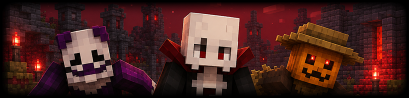
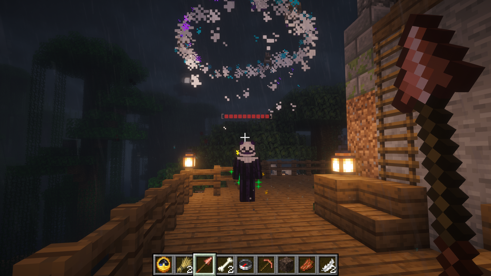
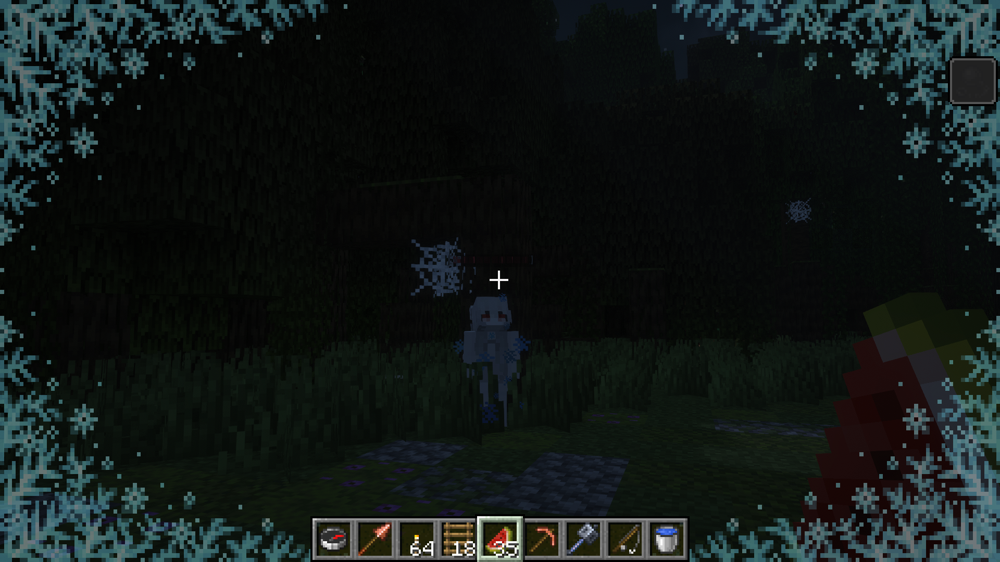
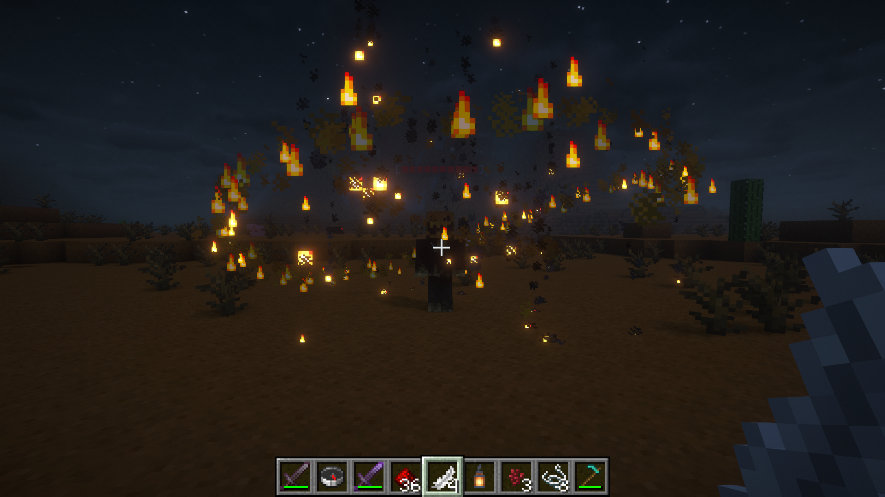
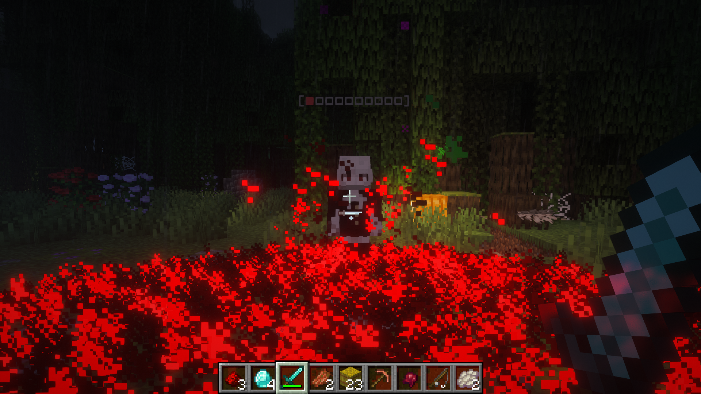
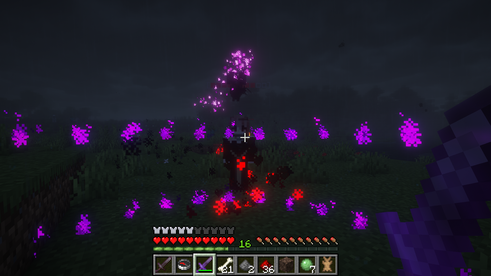
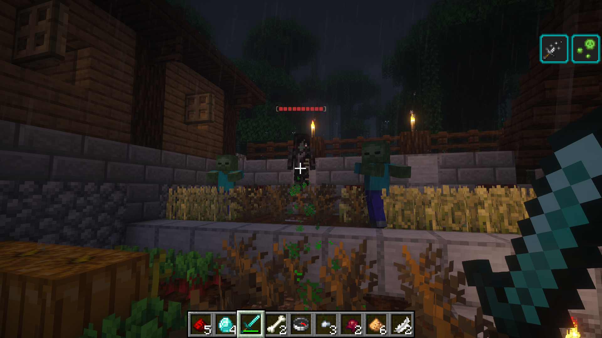

<p align="center">
  
</p>
<h1 align="center">Cobbleworks - Blood Moon Plugin</h1>
<p align="center">
  <b>Turn selected nights into high-pressure server events with seven distinct NPC encounters.</b><br>
  <b>Configure event frequency, difficulty, abilities, rewards, worlds, and encounter population.</b>
</p>
<p align="center">
  <a href="https://github.com/Cobbleworks/BloodMoon-Plugin/releases"></a>&nbsp;&nbsp;<a href="https://github.com/Cobbleworks/BloodMoon-Plugin/blob/main/LICENSE"></a>&nbsp;&nbsp;&nbsp;&nbsp;&nbsp;&nbsp;
</p>

BloodMoon Event turns selected Minecraft nights into server-wide encounters. During an active event, temporary Blockfolk NPCs spawn around players, use distinct combat mechanics, and disappear cleanly at sunrise. Administrators can configure eligible worlds and encounter values, test individual enemies, or change the active difficulty without restarting the server.

## Core Features

- Seven special NPCs: Vampire, Clown, Zombie, Witch, Scarecrow, Ghost, and Werewolf
- Per-player spawning with separate health, radius, and population limits for each NPC type
- Multi-phase encounters with telegraphed abilities, visual effects, and themed rewards
- Four live difficulty profiles that alter health, rewards, experience, and ability cadence
- Configurable world list, event chance, bleed behavior, NPC skins, and messages
- Admin controls for starting, stopping, testing, clearing, and reloading events
- Segmented overhead health bars and automatic cleanup of supporting entities

## Supported Platforms

- Minecraft 26.2
- Paper or a compatible Paper fork
- Java 25 or newer
- Blockfolk 1.3.0 or newer

## Table of Contents

1. [Core Features](#core-features)
2. [Supported Platforms](#supported-platforms)
3. [Installation](#installation)
4. [Third-Party Plugins](#third-party-plugins)
5. [How Blood Moons Work](#how-blood-moons-work)
6. [Special NPCs](#special-npcs)
7. [Configuration](#configuration)
   - [Event Settings](#event-settings)
   - [NPC Settings](#npc-settings)
   - [Bleed Settings](#bleed-settings)
   - [Difficulty Profiles](#difficulty-profiles)
8. [Commands](#commands)
9. [Permissions](#permissions)
10. [Performance and Operations](#performance-and-operations)
11. [Building From Source](#building-from-source)
12. [License](#license)
13. [Screenshots](#screenshots)

## Installation

1. Install [Blockfolk 1.3.0 or newer](https://github.com/Cobbleworks/Blockfolk-NPC-Plugin/releases) on Paper 26.2 with Java 25.
2. Download the latest BloodMoon jar from [Releases](https://github.com/Cobbleworks/BloodMoon-Plugin/releases).
3. Stop the server and place the Blockfolk and BloodMoon plugin jars in `plugins/`.
4. Start the server once to generate `plugins/BloodMoon-Event/config.yml`.
5. Add every world that should receive natural Blood Moons to `bloodmoon.worlds`.
6. Run `/bloodmoon status` to verify the setup. Use `/bloodmoon spawn vampire` while looking at a safe test location to check NPC creation.

BloodMoon 2.0 requires Blockfolk's temporary NPC API. Upgrade Blockfolk before BloodMoon. Existing BloodMoon configuration, signed skin textures, commands, and permissions are preserved. Citizens and Sentinel are no longer dependencies of either plugin; the previous BloodMoon release remains available for older servers.

## Third-Party Plugins

| Plugin | Required | Purpose |
|--------|----------|---------|
| [Blockfolk](https://github.com/Cobbleworks/Blockfolk-NPC-Plugin) 1.3.0+ | Yes | Supplies temporary mannequins, skins, native pathfinding, looking, and casting animations. |

BloodMoon owns each encounter's abilities, damage effects, phases, and rewards; Blockfolk supplies their visible NPCs and navigation. Bosses, witch mirror clones, and ghost echoes are owned by BloodMoon and never saved as administrator NPC presets. They are removed on death, event end, clear, or shutdown.

## How Blood Moons Work

- At the start of each night, every configured world receives one natural event roll.
- `bloodmoon.chance` is a **1-in-N** value. The default `24` means a one-in-24 chance, not 24 percent.
- A successful roll activates the atmosphere and announcements, then begins periodic per-player spawn passes.
- Each NPC type has its own spawn probability and `max-per-player` limit, preventing one encounter type from piling up around a player.
- The plugin does not replace vanilla hostile mobs. BloodMoon NPCs are an additional encounter layer.
- At sunrise, on an admin stop, or during plugin shutdown, active NPCs and their linked effects are cleaned up.
- NPCs created with `/bloodmoon spawn` do not require an active Blood Moon, making the command suitable for testing.

## Special NPCs

| NPC | Encounter Style | Notable Mechanics |
|-----|-----------------|-------------------|
| Vampire | Mobile blood mage | Begins disguised, drains health, summons bats, dashes, shields, and becomes especially dangerous near defeat. |
| Clown | Chaotic displacement | Uses fireworks, airborne minions, knockback, decoys, teleport tricks, and a faster manic phase. |
| Zombie | Infection bruiser | Spreads infection, creates toxic areas, summons a horde, and enters a low-health berserker phase. |
| Witch | Ritual controller | Cycles through spell phases with curses, cages, clones, traps, elemental attacks, and life drain. |
| Scarecrow | Area-denial reaper | Applies fear, drains nearby targets, controls space with hazards, and gains stronger harvest phases. |
| Ghost | Visibility challenge | Stalks while difficult to target, manipulates the environment, and can be revealed with nearby light sources. |
| Werewolf | Aggressive melee hunter | Leaps, bleeds targets, summons a pack, marks territory, and enters a feral low-health phase. |

Every special NPC shows a segmented overhead health bar. Players can use `/bloodmoon messages` to toggle phase announcements and `/bloodmoon healthbar` to confirm that health bars are enabled.

## Configuration

The generated `config.yml` is the source of truth for event and NPC values. Use `/bloodmoon reload` after editing it.

### Event Settings

| Key | Default | Purpose |
|-----|---------|---------|
| `bloodmoon.chance` | `24` | One-in-N chance evaluated when a configured world reaches night. |
| `bloodmoon.worlds` | `[world]` | Worlds eligible for natural Blood Moons. |
| `bloodmoon.special-mob-replace-chance` | `0.08` | Chance used by special-mob replacement behavior. Values are clamped from 0 to 1. |
| `messages.event-start` | `§4- THE BLOOD MOON RISES -` | Event start announcement. |
| `messages.event-end` | `§6The Blood Moon fades... for now.` | Event end announcement. |

### NPC Settings

Each NPC section supports `health`, `spawn-radius`, `max-per-player`, and signed Minecraft skin texture values. Some encounters provide additional tuning:

| Section | Extra Controls |
|---------|----------------|
| `vampire` | Minimum and maximum stalking duration |
| `clown` | Manic threshold and cadence, balloon cap, teleport hops, and snap radius |
| `zombie` | Infection timing and damage, infection jump radius, horde radius, phase threshold, and plague radius |

The Witch, Scarecrow, Ghost, and Werewolf sections expose their base health, spawn radius, population cap, and skin. Keep `max-per-player` conservative: raising the value increases both encounter density and tick work.

### Bleed Settings

| Key | Default | Purpose |
|-----|---------|---------|
| `bleed.chance` | `0.4` | Chance for a qualifying hit to apply bleed. |
| `bleed.damage-per-tick` | `1.0` | Damage dealt by each bleed tick. |
| `bleed.interval-ticks` | `40` | Time between bleed ticks. |
| `bleed.max-stacks` | `2` | Maximum simultaneous stacks on one target. |

### Difficulty Profiles

Difficulty starts at `medium` after a server start and can be changed for the current session.

| Profile | Non-Vampire Health | Rewards | Experience | Ability Interval |
|---------|--------------------|---------|------------|------------------|
| `easy` | 0.85x | 0.90x | 0.90x | 1.12x |
| `medium` | 1.00x | 1.00x | 1.00x | 1.00x |
| `hard` | 1.20x | 1.25x | 1.25x | 0.85x |
| `nightmare` | 1.38x | 1.55x | 1.60x | 0.72x |

A lower ability interval means abilities occur more frequently. The profile is not written to `config.yml`.

## Commands

`/bm` is an alias for `/bloodmoon`. Administrative commands require `bloodmoon.admin`.

| Command | Description |
|---------|-------------|
| `/bloodmoon start [world]` | Set the world to night and force-start an event. A player may omit the world. |
| `/bloodmoon stop [world]` | Stop one world's event, or all active events when no world is supplied. |
| `/bloodmoon status` | Show active worlds, chance, difficulty, NPC counts, and the next roll window. |
| `/bloodmoon spawn <type> [player]` | Spawn an NPC at the block a player is looking at, or near the named player. Console must supply a player. |
| `/bloodmoon clear [world]` | Remove BloodMoon NPCs in one world or across all worlds. |
| `/bloodmoon reload` | Reload the configuration and refresh active Vampire combat settings. |
| `/bloodmoon enable <world>` | Add a loaded world to the natural-event list and save the change. |
| `/bloodmoon disable <world>` | Remove a world from the list, save the change, and stop its active event. |
| `/bloodmoon chance <1-100>` | Set a temporary one-in-N chance override for the current session. |
| `/bloodmoon difficulty <profile>` | Select `easy`, `medium`, `hard`, or `nightmare` for the current session. |
| `/bloodmoon messages` | Toggle boss phase messages for the player running the command. |
| `/bloodmoon healthbar` | Show health-bar information to the player running the command. |

Spawn types are `vampire`, `clown`, `zombie`, `witch`, `scarecrow`, `ghost`, and `werewolf`.

## Permissions

| Permission | Default | Description |
|------------|---------|-------------|
| `bloodmoon.admin` | Operators | Access to event administration and manual NPC spawning. |
| `bloodmoon.healthbar` | Everyone | Access to `/bloodmoon healthbar`. |
| `bloodmoon.notify` | Everyone | Receive Blood Moon notifications. |

`/bloodmoon messages` is available to players and stores its preference for the running session.

## Performance and Operations

- Keep per-player limits at or near their defaults on populated servers; every NPC runs a dedicated encounter controller.
- Enable only worlds that should actually host Blood Moons.
- Monitor server tick rate after increasing population limits or using the faster difficulty profiles.
- Use `/bloodmoon clear [world]` if a test encounter needs to be removed without waiting for sunrise.
- Skin texture and signature values are public Minecraft profile properties supported by Blockfolk. Avoid hand-editing them unless you are deliberately replacing a skin.

## Building From Source

Requirements: Java 25 or newer and Maven 3.6 or newer.

```bash
git clone https://github.com/Cobbleworks/BloodMoon-Plugin.git
cd BloodMoon-Plugin
mvn clean package
```

The compiled jar is written to `target/`.

## License

This project is licensed under the [MIT License](LICENSE).

## Screenshots

<table>
  <tr>
    <th>Clown Bunny Bomb</th>
    <th>Ghost Freeze Effect</th>
  </tr>
  <tr>
    <td><a href="images/screenshot-clown-bunny-bomb.png"></a></td>
    <td><a href="images/screenshot-ghost-freeze.png"></a></td>
  </tr>
  <tr>
    <th>Scarecrow Flame Storm</th>
    <th>Vampire Hemoplague</th>
  </tr>
  <tr>
    <td><a href="images/screenshot-scarecrow-flame-storm.png"></a></td>
    <td><a href="images/screenshot-vampire-hemoplague.png"></a></td>
  </tr>
  <tr>
    <th>Witch Cage Magic</th>
    <th>Zombie Crop Poison</th>
  </tr>
  <tr>
    <td><a href="images/screenshot-witch-cage.png"></a></td>
    <td><a href="images/screenshot-zombie-crop-poison.png"></a></td>
  </tr>
</table>
